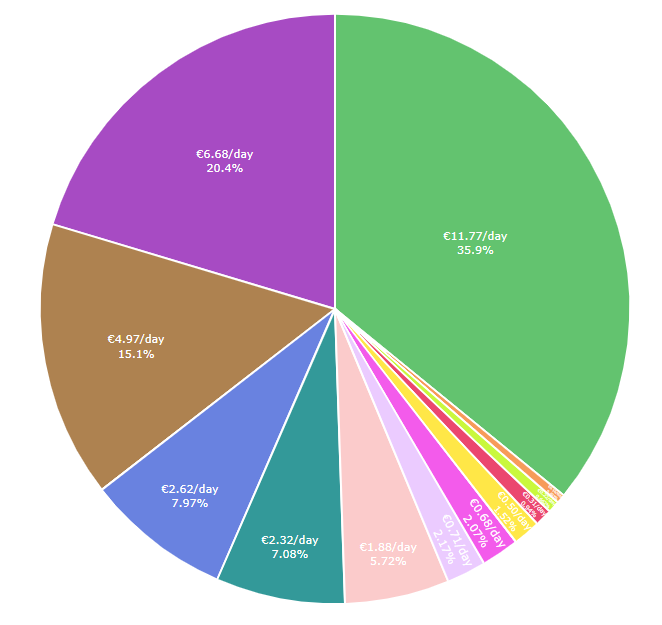
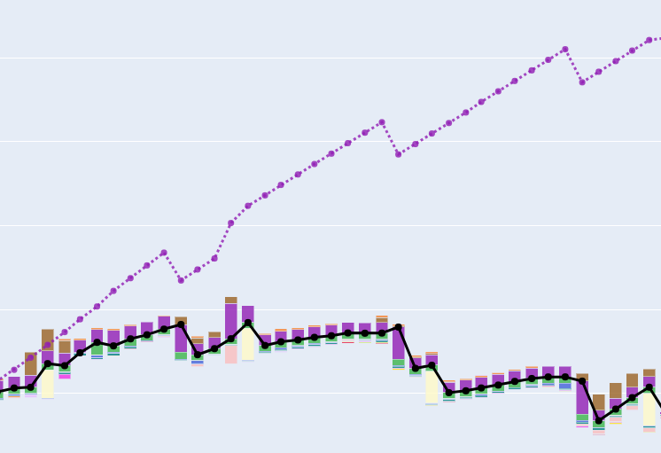
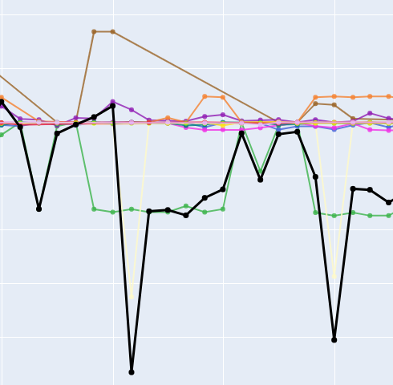

# FinancePy

Interactive personal finance visualization and anomaly detection for CSV exports.

## Overview

This script loads bank CSV files from `CSV_folder`, normalizes them into a single dataframe, tags each transaction, computes basic anomaly metrics, and generates several interactive HTML dashboards.





Main steps:
- Load all CSVs in `CSV_folder` and merge into one dataframe.
- Normalize columns (signed values, balance, time parsing, account, id).
- Generate / update `unique_ids_tags.csv` so you can assign human-readable tags per transaction id.
- Apply tags back onto the transaction dataframe.
- Compute anomaly metrics per transaction (intervals and repetition scores).
- Aggregate a monthly prediction index per tag and in total (based on days_since_prev, repetition_score, and value).
- Export CSVs with processed data and open Plotly HTML visualizations in your browser.

## Inputs

- `CSV_folder/` – contains the raw CSV exports from your bank. All `.csv` files inside are loaded.
- `unique_ids_tags.csv` – mapping from transaction `id` ("Naam / Omschrijving") to a `tag`.
  - On first run this file is created/updated with a list of ids and empty tags.
  - You can edit the `tag` column manually to classify transactions (e.g. `rent`, `groceries`, `salary`).

## Outputs

- `processed_finances.csv` – all tagged transactions after cleaning and normalization.
- `processed_finances_with_anomalies.csv` – same as above but with anomaly / prediction columns added.
- `anomaly_scores.csv` – compact view of anomaly-related fields per transaction.
- `monthly_prediction_index.csv` – monthly prediction index per tag and total.
- HTML visualizations (opened automatically in your browser):
  - `financial_visualization_interactive.html` – stacked "waterfall-like" monthly income/expenses by tag + balance line.
  - `monthly_expenses_line.html` – monthly expenses per tag as a line chart.
  - `daily_rate_pie_YYYY.html` and `daily_rate_pie_combined_....html` – daily spending rate per tag for individual years and combined.

## Requirements

- Python 3.10+ (tested with Python 3.12)
- See `requirements.txt` for Python packages.

## Installation

1. Create and activate a virtual environment (optional).
2. Install dependencies:

   ```bash
   pip install -r requirements.txt
   ```

## Usage

1. Place your bank CSV exports into `CSV_folder/`.
2. Run the script:

   ```bash
   python CSVisualizer.py
   ```

3. On the first run, check `unique_ids_tags.csv`, fill in or adjust tags, and run the script again.
   - empty tags are interpreted as 'other'
4. Open the generated HTML files (the script will try to open them automatically) to explore your finances.

## Notes

- The script expects column names (e.g. `Naam / Omschrijving`, `Rekening`, `Af Bij`, `Bedrag (EUR)`, `Saldo na mutatie`, `Datum`). If your exports use different names, adjust method:`process_dataframe` accordingly.
- Anomaly and prediction metrics are heuristic and meant for exploration.
- utulizes plotly's - probe support to observe values inside the graph